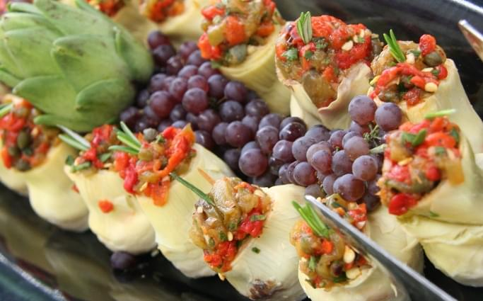
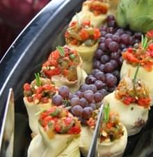
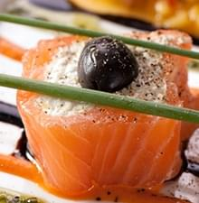
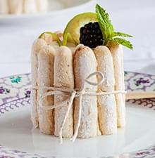
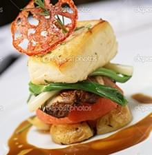
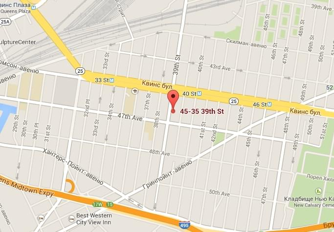

<!DOCTYPE html>
<html lang="en">

<head>
    <meta charset="UTF-8">
    <meta name="viewport" content="width=device-width">
    <title>Prime One NYC</title>
    <!--<link rel="stylesheet" type="text/css" href="css/reset.min.css">-->
    <link rel="stylesheet" type="text/css" href="css/style.min.css">
</head>

<body>
    <!-- HEADER -->
    <header class="header">
        

            <ul class="header__languages">
                <li class="header__languages-item">
                    EN
                </li>
                <li class="header__languages-item">
                    RU
                </li>
                <li class="header__languages-item">
                    ESP
                </li>
            </ul>
            <a href="#!" class="header__order link">ONLINE ORDERING</a>
            <figure class="header__logo-mobile">
                
            </figure>
            

                <nav class="header__nav">
                    <ul class="header__menu">
                        <li class="header__menu-item">
                            <a href="#catering" class="header__menu-link js-scroll">CATERING</a>
                        </li>
                        <li class="header__menu-item">
                            <a href="#benefits" class="header__menu-link js-scroll">CHOOSE
                                US!</a>
                        </li>
                        <li class="header__menu-item">
                            <a href="#footer" class="header__menu-link js-scroll">SAY
                                HELLO</a>
                        </li>
                    </ul>
                </nav>
                <figure class="header__logo">
                    
                </figure>
                <nav class="header__nav">
                    <ul class="header__menu">
                        <li class="header__menu-item"><a href="#!" class="header__menu-link">GALLERY</a></li>
                        <li class="header__menu-item"><a href="#!" class="header__menu-link">FRIENDS</a></li>
                        <li class="header__menu-item"><a href="#!" class="header__menu-link">CONTACT</a></li>
                    </ul>
                </nav>
                

                    
                

            

            

                
                
                
            

        

    </header>
    <!-- HEADER END -->

    <!-- INTRO -->
    <section class="intro">
        

            <figure class="intro__left">
                
            </figure>
            

                <h2 class="intro__title title">
                    PRIVATE CATERING
                </h2>
                <h4 class="intro__subtitle subtitle">
                    Treat your quests to a beautifully plated dinner, hand-crafted canapes or a casual BBQ.
                </h4>
                

                    <button class="intro__button button">
                        GET A QUOTE
                    </button>
                    <a href="#!" class="intro__link link">VIEW MENUS</a>
                

            

        

    </section>

    <!-- INTRO END -->

    <!-- CATERING -->
    <section class="catering" id="catering">
        

            

                

                    <figure class="catering__img">
                        
                    </figure>
                    <h3 class="catering__title title">
                        CORPORATE CATERING
                    </h3>
                    <h4 class="catering__subtitle subtitle">
                        We are able to serve events from 2 to 2000 guests and always reasonable prices.
                    </h4>
                    <button class="catering__button button">
                        GET A QUOTE
                    </button>
                    <a href="#!" class="catering__link link">VIEW MENUS</a>
                

                

                    <figure class="catering__img">
                        
                    </figure>
                    <h3 class="catering__title title">
                        PRIVATE CATERING
                    </h3>
                    <h4 class="catering__subtitle subtitle">
                        Fresh, seasonal and simple cuisine. Food is our business and our passion.
                    </h4>
                    <button class="catering__button button">
                        GET A QUOTE
                    </button>
                    <a href="#!" class="catering__link link">VIEW MENUS</a>
                

                

                    <figure class="catering__img">
                        
                    </figure>
                    <h3 class="catering__title title">
                        WEDDING CATERING
                    </h3>
                    <h4 class="catering__subtitle subtitle">
                        We use only the best organic ingredients and gluten and dairy free cooking.
                    </h4>
                    <button class="catering__button button">
                        GET A QUOTE
                    </button>
                    <a href="#!" class="catering__link link">VIEW MENUS</a>
                

                

                    <figure class="catering__img">
                        
                    </figure>
                    <h3 class="catering__title title">
                        ONLINE CATERING
                    </h3>
                    <h4 class="catering__subtitle subtitle">
                        Successful catering is about organisation, high quality service, and great food.
                        Successful catering is about organisation, high quality service, and great food.
                        Successful catering is about organisation, high quality service, and great food.
                        Successful catering is about organisation, high quality service, and great food.
                    </h4>
                    <button class="catering__button button">
                        GET A QUOTE
                    </button>
                    <a href="#!" class="catering__link link">VIEW MENUS</a>
                

            

        

    </section>
    <!-- CATERING END -->

    <!-- BENEFITS -->
    <section class="benefits" id="benefits">
        

            

                <h2 class="benefits__title title">WHY CHOOSE US?</h2>
            

        

        

            

                

                    

                        
                        

                            <h2 class="benefits__title-sm title">
                                ALWAYS FRESH
                            </h2>
                            <h4 class="benefits__subtitle subtitle">
                                Fresh, seasonal and simple cuisine. Food is our business and our passion.Fresh, seasonal
                                and simple cuisine. Food is our business and our passion.Fresh, seasonal and simple
                                cuisine. Food is our business and our passion.Fresh, seasonal and simple cuisine. Food
                                is our business and our passion.
                            </h4>
                        

                    

                    

                        
                        

                            <h2 class="benefits__title-sm title">
                                RELIABLE AND FLAWLESS
                            </h2>
                            <h4 class="benefits__subtitle subtitle">
                                Successful catering is about organisation, high quality service, and great food.
                            </h4>
                        

                    

                    

                        
                        

                            <h2 class="benefits__title-sm title">
                                CLEAN AND HEALTHY
                            </h2>
                            <h4 class="benefits__subtitle subtitle">
                                We use only the best organic ingredients and gluten and dairy free cooking.
                            </h4>
                        

                    

                    

                        
                        

                            <h2 class="benefits__title-sm title">
                                FITS ANY SIZE AND BUDGET
                            </h2>
                            <h4 class="benefits__subtitle subtitle">
                                We are able to serve events from 2 to 2000 guests and always at reasonable prices.
                            </h4>
                        

                    

                

            

        

    </section>
    <!-- BENEFITS END -->

    <!-- FOOTER -->
    <footer class="footer" id="footer">
        

            

                

                    <h2 class="footer__title title">
                        SAY HELLO
                    </h2>
                    

                        
                        
45-35 #B 39th St, Sunnyside, NY 11104

                    

                    

                        
                        
(718) 777-7777

                    

                

                

                    

                        
                        
contact@primeone.com

                    

                    

                        
                        
                        
                        
                    

                

            

            

                <figure class="footer__map">
                    
                </figure>
                

                    <form action="#" method="get" enctype="multipart/form-data" class="form">
                        <h2 class="form__title title">
                            GET IN TOUCH
                        </h2>
                        <input type="text" name="name" class="form__input-name" placeholder="Name">
                        <input type="text" name="emailphone" class="form__input-emailphone"
                            placeholder="E-mail or phone number">
                        <textarea name="message" class="form__textarea" placeholder="Your message"></textarea>

                        <button type="submit" class="form__button button">SEND MESSAGE</button>
                    </form>
                

            

            

                

                    © PrimeOne Catering 2014.
                    <a href="#!" class="footer__terms">Terms & Conditions</a>
                

                <figure class="footer__logo">
                    
                </figure>
            

        

    </footer>
    <!-- FOOTER END -->
    
</body>

</html>

<!--

            

                <h2 class="benefits__title title">WHY CHOOSE US?</h2>
            

            <figure class="benefits__right">
                
            </figure>
        
 -->